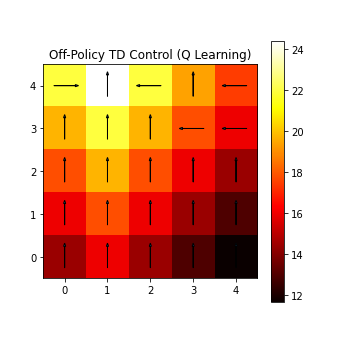
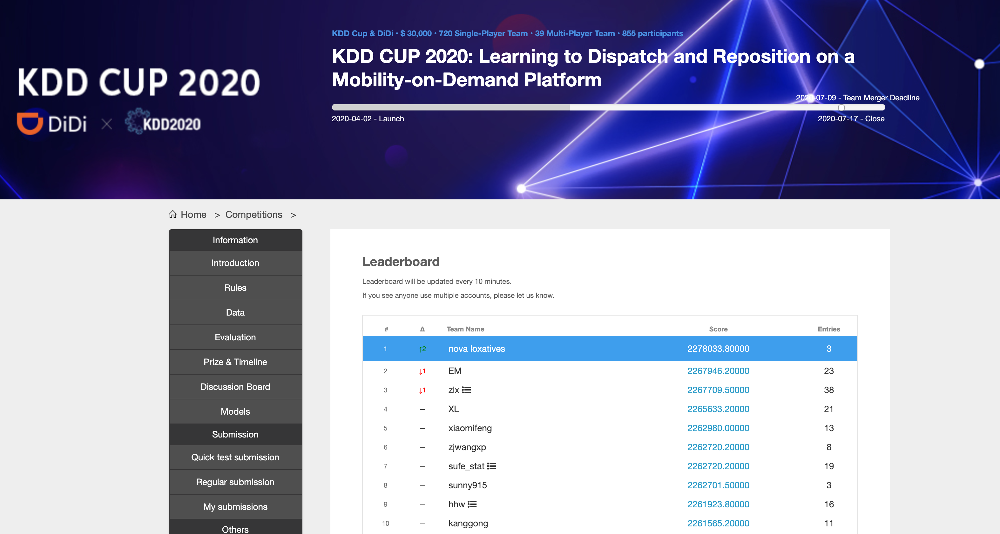
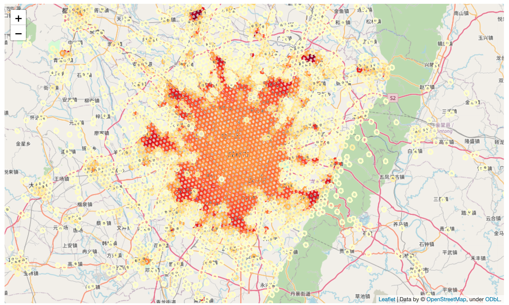

# Reinforcement Learning
Illustrated examples from Sutton & Barto

## Sutton & Barto Exercise 5.12: Racetrack

[nbviewer](https://nbviewer.jupyter.org/url/github.com/laxatives/rl/blob/master/racetrack_monte_carlo.ipynb)

### SciPy John Hunter 2020 Data Visualization Competition Entry
**Abstract** (Framed for a general scientific audience):
The gridworld is the canonical example for Reinforcement Learning from exact state-transition dynamics and discrete actions. Unlike traditional machine learning models that can be reliably backtested over hold-out test data, reinforcement learning algorithms are better examined in interaction with their environment. In this short GIF, an agent learns to traverse the grid by controlling acceleration in 2-dimensions.

To learn the appropriate driving policy, we apply Value Iteration, modeling the track as a Markov-Decision Process described by the vehicle position and velocity. The agent learns to apply the acceleration that minimizes the estimated remaining time at the next (position, velocity) state. The estimated remaining time is updated from the observed time required to navigate the circuit from every visited state in the iteration. Updates to these estimates also improve the action policy and expose new paths in the following iteration. We force a random acceleration vector in 10% of timesteps to encourage path exploration.

In this GIF, we display the expected remaining time to complete a right-hand turn for each position in the grid (white is shorter, red is longer). For every 2000 iterations, we observe our driver (blue square) attempting to maneuver the course from the starting line on the bottom row by accelerating and decelerating their vehicle (red and green arrows respectively) while avoiding out-of-bounds positions. The driver's new velocity (black arrow) is the vector sum of their previous velocity and their current acceleration control input. Initially, the agent can only reach the finish line via random walk. However after 10,000 iterations, the agent has found the optimal policy, maintaining a racing line by starting the turn wide before committing to the apex.

Although this is a toy-problem, Value Iteration forms the basis for many algorithms used in Reinforcement Learning and robotics. The same principle can be applied to continuous state spaces with infinite actions as well as to noisy and complex environments.

## Sutton & Barto Example 3.5/3.8: Gridworld

Illustrated solutions to the Gridworld example using algorithms described in part 1, Tabular Methods:

- Linear Programming
- Dynamic Programming
- Monte Carlo 
  - Prediction
  - Control
    - On Policy
    - Off Policy
- Temporal Difference
  - Prediction
  - Control 
    - On Policy
      - SARSA
    - Off Policy
      - Q Learning
      - Double Q Learning
- N-Step TD
  - Prediction
  - Control
    - On Policy
    - Off Policy

[nbviewer](https://nbviewer.jupyter.org/url/github.com/laxatives/rl/blob/master/gridworld_mdp.ipynb)

# Other Applications

## Distributed Asynchronous Learning using Ray and Multi-Armed Bandits

[nbviewer](https://nbviewer.jupyter.org/url/github.com/laxatives/rl/blob/master/ray.ipynb)

Some simple Multi-Armed Bandit algorithms provide distributed streaming online updates to a shared parameter store (such as DynamoDB). A simple Thompson Sampling algorithm can be used to estimate performance for
- Bernoulli Distributions (using a Beta-distributed conjugate prior)
- Normal Distributions (using a Normal-Inverse-Gamma conjugate prior)
- Multivariate Normal Distributions (using a Normal-Inverse-Wishart conjugate prior)

A few simple CRUD update endpoints enables widescale experimentation using hundreds or thousands of variants (compared to just 2 in a traditional A/B experiment).

## Reinforcement Learning for Ridehailing Dispatch and Pricing

We have open-sourced our solution (Team Hail Mary) for the ACM SIGKDD CUP 2020: Learning to Dispatch and Reposition.

This work formed the basis for our [2022 ACM SIGKDD Paper](https://dl.acm.org/doi/pdf/10.1145/3534678.3539141) and Lyft's submission to the [2023 Franz Edelman Award for Achievement in Advanced Analytics, Operations Research and Management Science](https://www.informs.org/News-Room/INFORMS-Releases/Awards-Releases/Finalists-Selected-for-the-World-s-Leading-Operations-Research-and-Analytics-Award-2023-INFORMS-Franz-Edelman-Award-Competition-Elevates-Research-that-is-Saving-Lives-Saving-Money-and-Solving-Problems)
